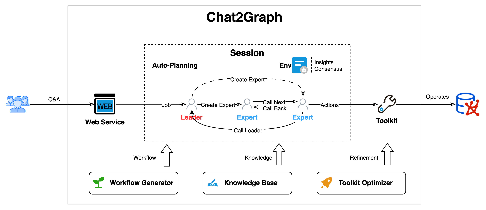

# Chat2Graph 架构

## 1. Agentic System 关键问题

- 推理能力：双/单推理机
- 规划能力：自动规划器
- 记忆能力：DIKW 分层记忆系统
- 工具调用：工具图谱

## 2. 开放的开源生态网络

- 接入开源 Agent 框架，比如 DB-GPT
- 接入开源大模型, 比如 Qwen、DeepSeek
- 接入开源工作流框架，比如 DB-GPT
- 支持 MCP、A2A（TODO）
- ……

## 3. 物理图

从自然语言输入到复杂图分析与知识发现的端到端问题，这是 Chat2Graph 所擅长解决的。下图物理架构展示了其核心模块的联系：用户以自然语言向 Chat2Graph 提出分析需求，例如“帮我分析《罗密欧》人物关系结构？”。Chat2Graph 接收此高级指令后，其内部的“多智能体系统”便被激活，启动一个相互协调的自动化流程。

Chat2Graph 能够将用户的高阶、自然语言指令，智能地转化为一系列精确、自动化的图构建、数据处理、算法应用和迭代优化的步骤。这极大地降低了用户进行复杂图分析的技术门槛，使得非技术背景的用户也能利用图的强大表达能力进行深度探索和知识发现：

Chat2Graph 特别适用于以下场景：

- **自然语言驱动的知识图谱构建与交互式探索**: 从海量文本、报告或各类数据源中自动构建领域知识图谱，并允许用户通过自然语言进行查询、分析与可视化。
- **复杂关系网络的深度分析**: 在社交网络分析、金融风控（如反欺诈、关联交易识别）、供应链优化、生物信息学（如蛋白质相互作用网络分析）、情报分析等领域，揭示实体间的深层联系、关键节点和社区结构。
- **智能问答与决策支持**: 基于动态构建和更新的知识图谱，提供上下文感知的高级问答服务，为复杂决策提供数据驱动的洞察。
- **自动化工作流构建**: 将涉及复杂流程自动化，我们将会在未来提供该功能。

让 Chat2Graph 成为连接自然语言与图智能的桥梁。
