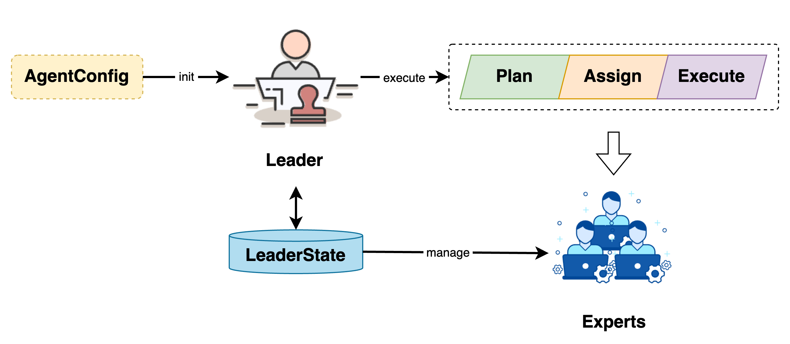
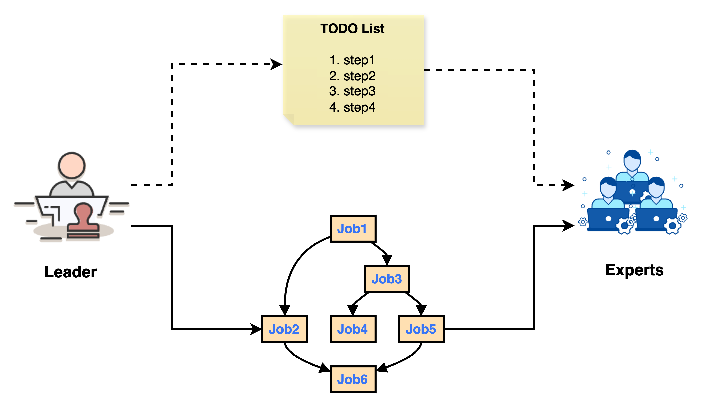
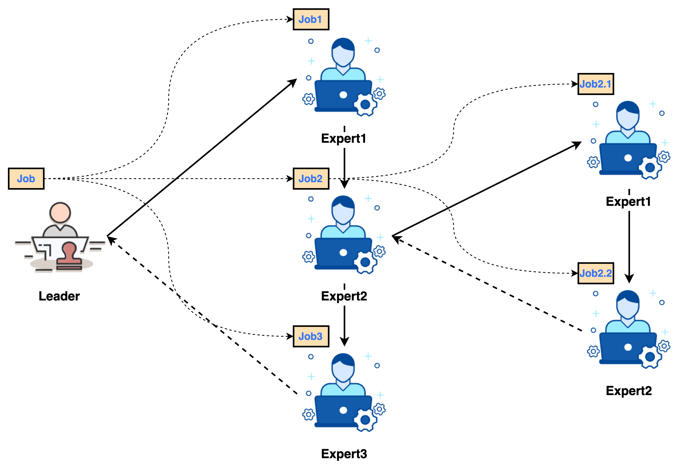

# Leader

## 1. 介绍

作为 Chat2Graph 系统的核心组件与任务主入口，Leader 负责任务的规划、分配和执行，以及 Expert 生命周期的管理。

## 2. 设计

Leader 通过 `AgentConfig` 初始化，并通过 `LeaderState` 管理 Expert 生命周期。任务提交给 Leader 后，会经历任务规划、任务分配与任务执行三个阶段。

## 2.1. 规划

智能体规划器主要负责智能体任务的规划与拆解，不同于传统智能体系统的线性规划器，Chat2Graph 采用基于图结构的规划器，在将智能体任务拆分为可执行单元的同时，保留了子任务间的依赖关系，以更好地应对任务执行的不确定性。

规划器的核心在于一个精心设计的 Prompt，即 `JOB_DECOMPOSITION_PROMPT`，它指导 `Leader` 将一个主任务（`Given Task`）分解为一系列可执行的子任务。`Leader` 将首先结合对话历史与系统当前状态，来主动推断用户的真实意图和期望的下一个逻辑步骤。基于此推断，`Leader` 需确定完成该步骤所需的目标专家（`Expert`）及其行动。任务分解是其唯一输出，即使在信息不完整的情况下（例如用户提及忘记上传文件），也必须为相关专家制定子任务，并在子任务上下文中注明潜在问题。分解时，LLM 应力求最少的必要逻辑子任务，同时确保子任务的分配仅限于先前确定的专家。每个子任务需包含所有必要信息，保持角色中立，并严格限制在原始任务范围内。对于简单或仅需单一专家的任务，则应生成单个子任务。

`Leader` 在收到原始任务（`OriginalJob`）后，若无预设 `Expert`，则将其分解为一张子任务图（`JobGraph`）。这张图是一个有向无环图（DAG），其中节点代表子任务（`SubJob`），边代表子任务间的依赖关系。

> 如果原始任务已经预设了 `Expert`，那么 `Leader` 将会跳过任务拆解的过程，然后直接将该任务分配给预设的 `Expert`，同时 `JobGraph` 将只有一个节点，即原始任务。

Chat2Graph 明确定义子任务包含的字段，参考 `JOB_DECOMPOSITION_OUTPUT_SCHEMA`，并使用 `JobGraph` 表达子任务之间的依赖关系。

| 字段                  | 描述                                                                                                |
| :-------------------- | :-------------------------------------------------------------------------------------------------- |
| `goal`                | 目标，必须精确反映用户最新请求。                                                                            |
| `context`             | 上下文，需包含对话历史摘要、用户反馈以及这些上下文如何塑造当前任务。                                                              |
| `completion_criteria` | 完成标准，需明确且可衡量，直接回应对话历史中突显的需求或修正。                                                                |
| `dependencies`        | 依赖关系，仅在生成多个子任务时定义，用于确定子任务之间的依赖关系，形成一张 `JobGraph`，由 `JobService` 负责管理。                               |
| `assigned_expert`     | 分配的专家名，Leader 指定该子任务由哪位专家完成。                                                                        |
| `thinking`            | 思考过程，要求 LLM 以第一人称解释生成该子任务的思考过程，包括其必要性、初步方法及关键考量（冗余字段）。                                                          |

## 2.2. 分配

任务分配阶段，`Leader` 根据 `JobGraph` 组织的子任务关系，分配对应的专家执行。

1. **并行任务调度**：`Leader` 使用线程池并行调度无前置依赖或所有前置依赖已完成的子任务。它会持续监控任务状态，一旦任何某个子任务的所有前置任务完成，该子任务即被提交执行。
2. **分配 Expert 处理**：每个子任务 `SubJob` 被分派给指定的 `Expert`。`Expert` 执行其内部工作流（`Workflow`）来处理子任务。

## 2.3. 执行

我们借助状态机来解释 `Job/SubJob` 与 `Agent` 之间的传递、转换机制。
 

当 `Expert` 执行完 `SubJob` 后，会返回一个 `WorkflowMessage`，其中包含 `workflow_status`，该状态决定了后续流程：
  - `SUCCESS`：子任务成功完成。`Leader` 会记录结果，并更新 `JobGraph` 的状态，进而可能触发后续依赖任务的执行。
  - `EXECUTION_ERROR`：`Expert` 执行过程中发生内部错误（如 API 请求失败）。`Leader` 会根据重试策略（`retry_count`）决定是否重试该 `Expert` 的执行。若达到最大重试次数，则该子任务及整个 `JobGraph` 可能会被标记为 `FAILED`。
  - `INPUT_DATA_ERROR`：`Expert` 判断输入数据有问题，无法继续执行。`Leader` 接收到此状态后，会将此子任务及其前置依赖任务重新加入待处理队列，并可能附带 `lesson`（经验教训）给前置任务的 `Expert`，以便修正输出。
  - `JOB_TOO_COMPLICATED_ERROR`：`Expert` 认为当前子任务过于复杂，无法独立完成。`Leader` 会将此子任务视为一个新的“原始任务”，再次调用任务分解逻辑，将其进一步细化为更小的子任务，并更新到 `JobGraph` 中。为防止无限分解，子任务设有生命周期（`life_cycle`）计数 —— 每一次任务分解，生命周期将会减少 1，直到 0 为止。

当 `JobGraph` 中的所有子任务都成功完成，整个原始任务即告完成。若任何关键子任务最终失败或整个图的执行被中断（例如，`Leader` 调用 `fail_job_graph` 或 `stop_job_graph`），则原始任务会相应地标记为 `FAILED` 或 `STOPPED`。

这种状态机确保了任务能够根据依赖关系进行并行处理，同时具备对执行过程中各类情况的适应性和纠错能力。此外，`JobGraph` 还支持中断（`stop_job_graph`）和恢复（`recover_original_job`）操作，使得在 `planner` 调度下的多智能体协作更加灵活和可控。

## 3. API

`Leader` Agent 提供的核心 API 如下。

| 方法签名                                     | 描述                                                                                                                                                                                                                                                           |
| :--------------------------------------------------------------- | :------------------------------------------------------------------------------------------------------------------------------------------------------------------------------------------------------------------------------------------------------------------------------- |
| `execute(self, agent_message: AgentMessage, retry_count: int = 0) -> JobGraph` | 核心的任务分解方法。接收一个包含待处理任务（可能是原始任务或需要进一步分解的子任务）的 `AgentMessage`。如果任务已预设专家，则直接创建单节点 `JobGraph`；否则，调用其内部工作流 (`Workflow`) 和推理器 (`Reasoner`) 将任务分解为一张子任务图 (`JobGraph`)。此方法包含对分解结果的校验和基于 `lesson` 的重试逻辑。 |
| `execute_original_job(self, original_job: Job) -> None`          | 接收一个原始任务 (`OriginalJob`)。首先将其状态更新为 `RUNNING`，然后调用 `execute` 方法将其分解为子任务图，并将此图存入 `JobService`。最后，调用 `execute_job_graph` 来执行这张图。                                                                                                                            |
| `execute_job_graph(self, original_job_id: str) -> None`          | 执行指定 `original_job_id` 对应的子任务图 (`JobGraph`)。它使用 `ThreadPoolExecutor` 并行调度无依赖或所有前置依赖已完成的子任务。此方法处理子任务执行后的不同 `WorkflowStatus`（如 `SUCCESS`, `INPUT_DATA_ERROR`, `JOB_TOO_COMPLICATED_ERROR`），并据此更新任务图状态或重新调度任务。                 |
| `stop_job_graph(self, job_id: str, error_info: str) -> None`     | 停止与给定 `job_id` (可以是原始任务 ID 或子任务 ID) 相关的整个任务图。将原始任务及所有未完成（且无最终结果）的子任务状态标记为 `STOPPED`，并记录错误信息作为系统消息。正在运行的任务不会被强制中断，但其完成后状态也会被相应更新。                                                                                             |
| `fail_job_graph(self, job_id: str, error_info: str) -> None`     | 标记指定的 `job_id` 对应的任务结果为 `FAILED`（如果尚无最终结果），然后调用 `stop_job_graph` 来停止相关的整个任务图，并将其他未完成任务标记为 `STOPPED`。                                                                                                                                                              |
| `recover_original_job(self, original_job_id: str) -> None`       | 恢复一个先前被标记为 `STOPPED` 的原始任务。如果该原始任务没有子任务（即未被分解），则将其状态重置为 `CREATED` 并重新调用 `execute_original_job`。如果已有子任务，则将原始任务状态设为 `RUNNING`，并将所有状态为 `STOPPED` 的子任务重置为 `CREATED`，然后重新调用 `execute_job_graph`。 |
| `state(self) -> LeaderState` (property)                          | 获取 `Leader` 的状态对象 (`LeaderState`)。该状态对象管理 `Leader` 可用的 `Expert` 列表等运行时状态信息。                                                                                                                                                                              |

## 4. 示例

以下展示了一个典型的图数据任务的处理场景：

以下是一些代码示例：

* Leader 执行字符串处理任务：`test/example/agent/run_leader_v1.py`
* Leader 执行自然语言处理任务：`test/example/agent/run_leader_v2.py`
